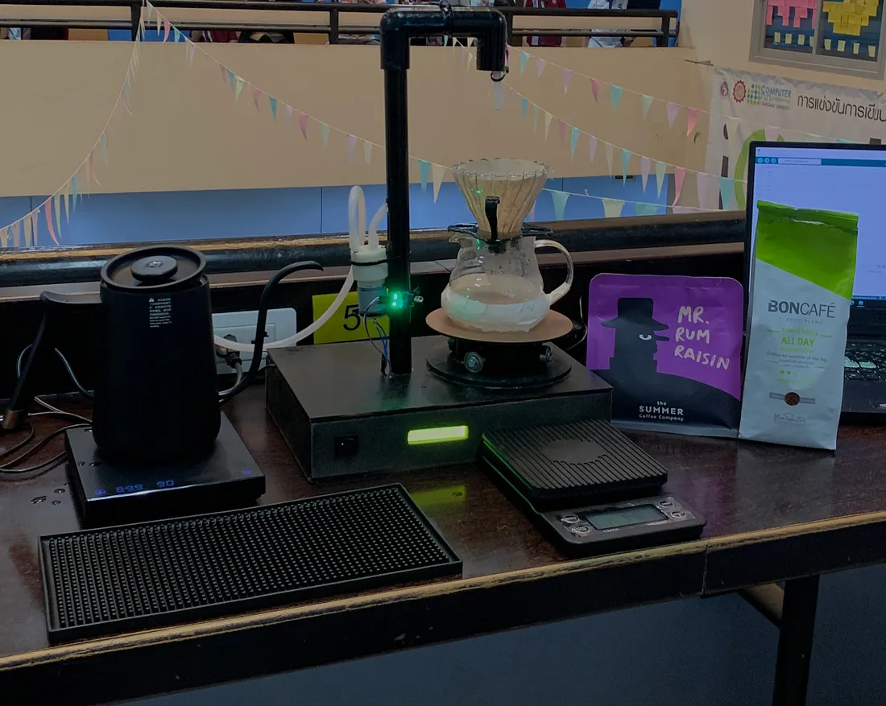
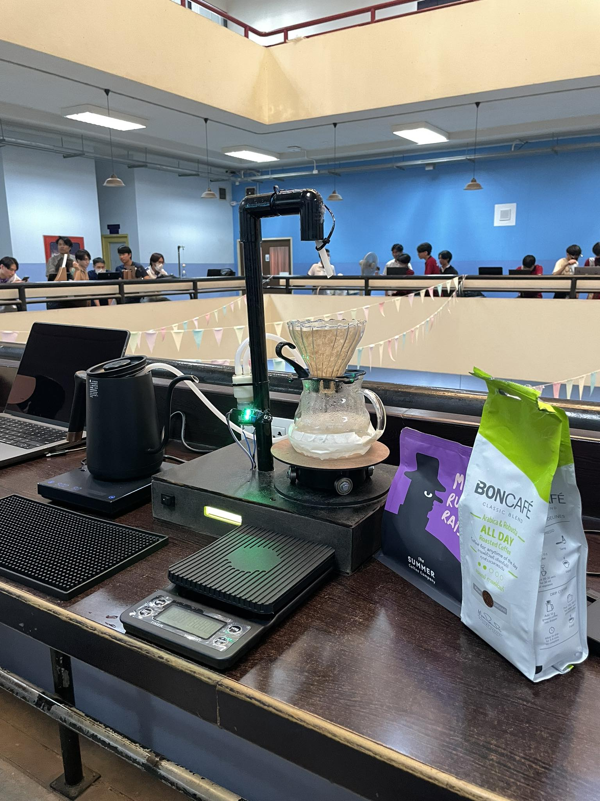
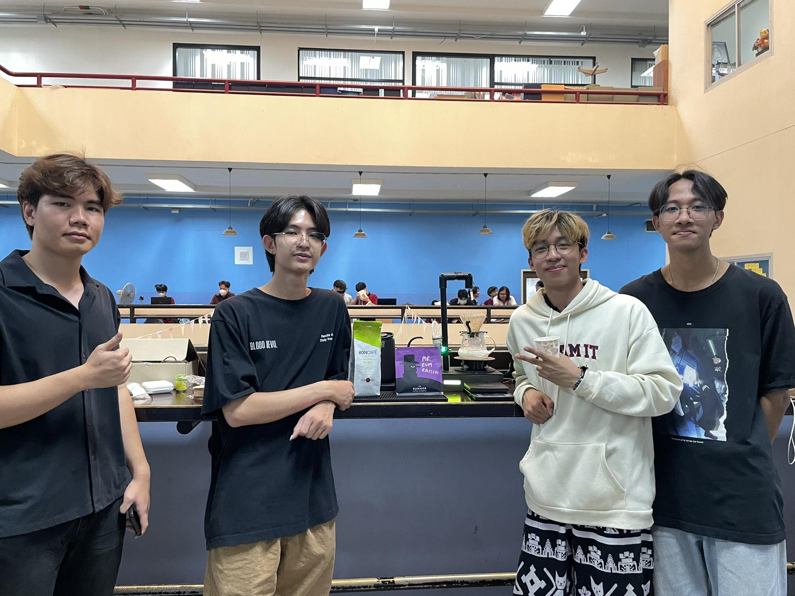

# **Automatic Drip Coffee Machine – Group 2.2**
Final project from Embedded System Laboratory and Microprocessor class

## **Description**
We developed an automatic drip coffee machine to address the effort and time required for manual coffee dripping. Our goal was to enhance user convenience by allowing operation via MQTT, where users can select pre-programmed drip recipes stored in the MCU.

## **Feature**
- MQTT: Choose dripping recipes on MQTT dashboard.
- Convenient: Automatic dripping just by press.
- Pump Control: Ensures precise water dispensing according to the recipe.
- Drip Tray Rotation: Ensures even water distribution over the coffee grounds.
- Infrared Sensor: Detects whether a cup is placed to prevent operation without a cup, enhancing safety.
- LCD Display: Shows real-time system status.

## **Equipment**
- Infrared sensor 
- 12V hot water pump
- Heat-resistant rubber pipe
- Transistor TIP31C
- Switch
- 12V power supply
- Wooden board
- LCD Monitor
- PVC pipe
- ESP 32
- Resistor
- 5V stepping motor
- Coffee drip equipment including drip cup / drip pad holder / drip pad / hot water kettle
- Coffee beans

## **Dripping Method**
We use 4:6 method from Tetsu Kasuya, the 2016 World Brewers Cup Champion, for the main dripping recipes. 

The "4:6 method," a brewing technique that focuses on dividing the water into 40% and 60% pours to control the coffee's flavor and concentration

## **How it work**
The machine follows a drip coffee process, specifically based on Tetsu Kasuya’s four-pour method, using hot water at 90°C.

- 1st Pour: 30 ml of water for 30 seconds
- 2nd Pour: 60 ml of water for 10 seconds, then wait 15 seconds
- 3rd Pour: 70 ml of water for 10 seconds, then wait 15 seconds
- 4th Pour: 70 ml of water for 10 seconds
The total process takes 1 minute 45 seconds, using 230 ml of water in total.

## **Video**
https://www.youtube.com/watch?v=O5ELGJ4_iuQ

